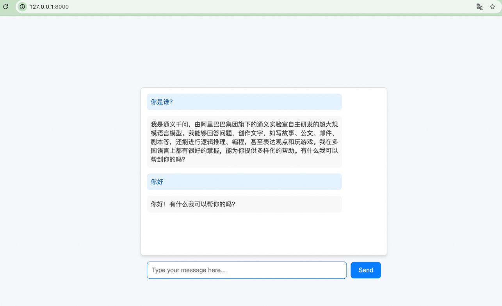

# My Chat App

My Chat App is an open-source chatbot application based on Qwen, Alibaba Cloud's large language model. It supports interaction with Qwen via the web site or REST API and can be easily deployed in a local environment.

## Features

- **Powered by Qwen**: Utilizes Alibaba Group's large-scale language model (Qwen).
- **Multiple Interaction Modes**:
  - Page Access interaction: Chat directly in the terminal.
  - REST API interface: Supports integration with other systems.
- **Easy Deployment**: Supports pip installation and local execution.
- **Extensibility**: You can replace the model or add more features as needed.

---

## Quick Start

### **1. Environment Setup**

Ensure your development environment meets the following requirements：
- **Python Version**：Python 3.7 or higher。
- **Operating System**：Supports Windows、macOS and Linux。
- **Network Connection**：Requires access to Alibaba Cloud services to call the Qwen API。

---

### **2. Install Dependencies**

#### **Clone the Projec**
If you are installing from source, clone the project first：
```bash
git clone git@atomgit.com:flow-step/my-chat-app.git
cd my-chat-app
```
#### **Install Dependencies**
Run the following command in the project root directory to install the required Python packages:
```bash
pip install -r requirements.txt
```
If there is no requirements.txt file, you can directly install the following dependencies:
```bash
pip install fastapi uvicorn openai requests
```

### **3. Configure API Key**

Qwen requires a valid API key to work. You need to obtain the API key from Alibaba Cloud and set it as an environment variable.

Obtain API Key

1. Log in to the Alibaba Cloud Console.
2. Go to the [ModelScope Platform or Qwen Lab](https://bailian.console.aliyun.com), and find your API key.
3. Copy the API key（e.g., sk-xxx）and replace the api_key in modle.py.(Or set the api_key as an environment variable, so you only need to change the environment variable each time.)

### **4. Start the Service**

Run the following command to start the chat application server:
```bash
  export DASHSCOPE_API_KEY=sk-xxx # Replace your own API_KEY
 uvicorn my_chat_app.app:app --reload
```
If everything is normal, you will see log output similar to the following:
```text
INFO:     Will watch for changes in these directories: ['/Users/lyb/projects/my-test/my-chat-app']
INFO:     Uvicorn running on http://127.0.0.1:8000 (Press CTRL+C to quit)
INFO:     Started reloader process [95693] using StatReload
INFO:     Started server process [95695]
INFO:     Waiting for application startup.
INFO:     Application startup complete.
INFO:     127.0.0.1:55672 - "GET / HTTP/1.1" 200 OK
INFO:     127.0.0.1:55672 - "GET /static/script.js HTTP/1.1" 200 OK
INFO:     127.0.0.1:55709 - "POST /chat HTTP/1.1" 200 OK
```
At this point, the service has started and is listening on http://127.0.0.1:8080.

### **5. Usage**

#### **Page access Interaction**
Visit http://127.0.0.1:8080 , to communicate with Qwen:



#### **REST API Testing**
If you want to test the chat functionality via REST API, you can use curl or Postman to send requests.

- Send Request

Run the following command:
```bash
curl -X POST http://127.0.0.1:8000/chat \
     -H "Content-Type: application/json" \
     -d '{"message": "你好"}'
```
- Response

You will receive a JSON response similar to the following:
```json
{
  "response": "Hello! I am Qwen, a large-scale language model developed by Alibaba Group. How can I assist you?"
}
````
### **6. Troubleshooting**
Issue 1: Service Fails to Start
- Cause: Port is occupied, or dependencies are not installed.
- Solution: 
    - Check port usage:
  ```bash
  lsof -i :8080
  ```
  - Kill the process occupying the port:
  ```bash
  kill <PID>
  ```
  - Ensure all dependencies are installed correctly.

Issue 2：Slow Response

- Cause: Network latency or Qwen service is busy.
- Solution:
    - Check your network connection.
    - If the issue persists, try again later.

### **7. Contribution and Feedback**
If you have any suggestions for improvement or discover bugs, feel free to submit an Issue or Pull Request:

GitHub Repository: https://github.com/lybcodes/my-chat-app.git

### **8. License**
This project is licensed under the MIT License. For details, see the LICENSE file.


I hope this document helps you get started with your AI chat application quickly! If you have any other requirements or need further improvements to the document, please let me know at any time!

